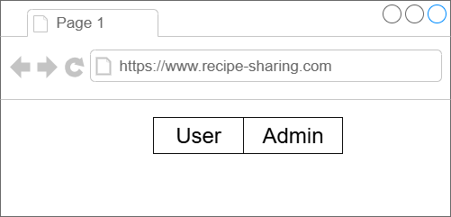

# Recipe-Sharing
A recipe sharing Application

# Project overview
In this project, we will work on an application for sharing recipes, where a user can create, delete, or
read their recipes. We will implement both a backend and a frontend to develop a fully
functional web application.

## Functional Requirements
Our application should serve two different profiles: admins and end users.
 - Platform admin: The platform owner, who may want to create a new recipe, maintain it, or even delete it.
 - End users/consumers: The end user, who uses the platform for accessing a specific recipe, and should not be able to create, change, or delete any record.

 We will start with two different pages, **/users** for the end users and **/admin** for admins, to support the two differnt personas.

 

 Breaking down the different functionalities and interfaces.

**/user**

- Access the list of recipe titles
- Ability to choose a specific recipe and access all the details.
- Responsive.

**/admin**

- Access the list of recipe titles.
- Ability to delete recipes.
- Support recipe creation.
- Control the maximum amount of ingredients, steps, and recipes supported
- Responsive.

## Non-functional requirements

- Global distribution to serve users spread across the globe.
- Auto-scaling to handle the spiky usage pattern.
- Cost-effectiveness.

## Technical requirements

- Modern frontend framework - React.js
- Backend programming language - Python
- FastAPI as the framework for API development.

## Data requirements

Operations to implement are the following:

- **List the recipes**: Present a list of the recipes created.
- **Delete a recipe**: If an admin no longer wants a speccific recipe to be part of the portfolio, it should be possible to delete the item.
- **Create a recipe**: Create a new recipe to share with the users.

recipe_example.json:
<pre>
{
    "ID": "GUID",
    "Title": "recipe title",
    "Ingredients": [...],
    "Steps": [...]
}
</pre>